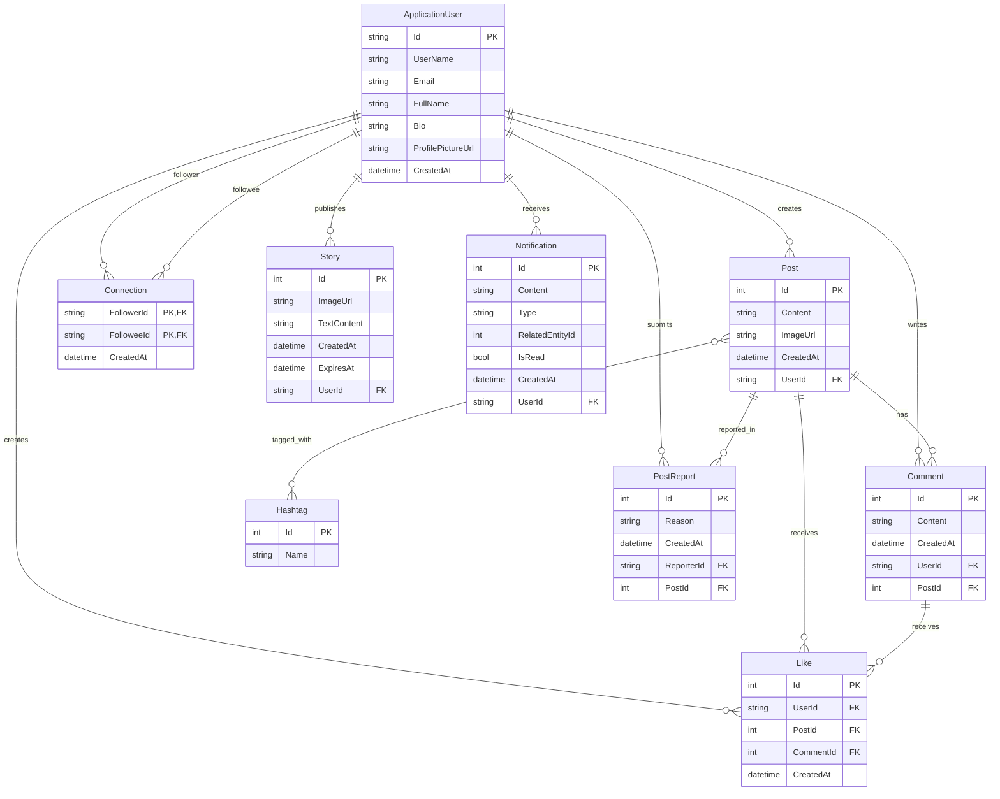

# Database Schema

This document provides the entity relationship model for the InteractHub backend.

## ER Diagram



## SQL Script Generation (EF Core CLI)

Run the following command from the Backend folder to generate the SQL script for graders:

```bash
dotnet ef migrations script -o database_script.sql
```

Output file:

- `database_script.sql` in the current working directory.
